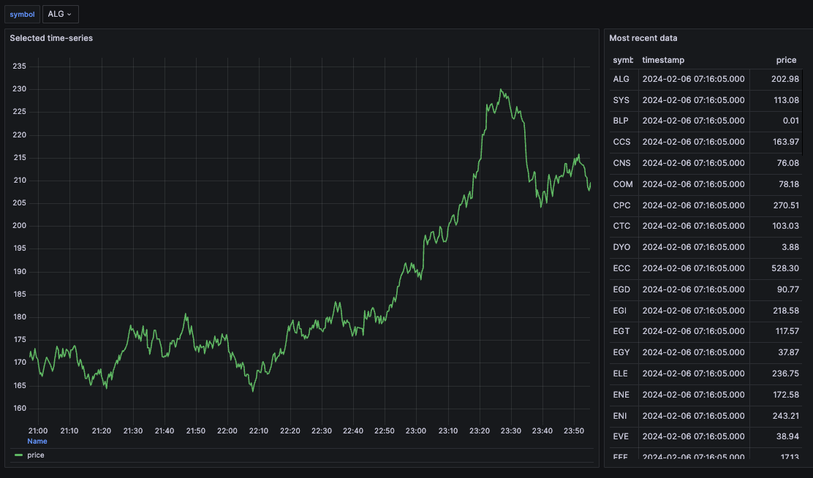

# The Zero-to-Tinybird Workshop 

This repository is a companion piece to the 'Zero-to-Tinybird` 90-minute workshop. The intended audience of this workshop are people who have no experience with Tinybird and are looking to learn the basics with 90 minutes of hands on content. The intent of this workshop is to teach the basics of creating Data Sources, building Pipes, designing Materialized Views, deploying API Endpoints with dynamic query parameters, and providing introductions to the Tinybird command-line interface (CLI) and working with Tinybird projects under version control. 

This repository includes resources to help attendees find documentation and other content focused on these topics. It also includes the Data Project used in the workshop. Workshop content is based on a real-time stream of mocked stock prices and a supporting dimensional table of company metadata. 

## Workshop sections

* Tinybird overview
* [Creating Data Sources](#creating-data-sources)
* Building data analysis pipelines
* Introduction to Materialized Views
* Introduction to the Tinybird CLI
* Using version control with data projects


## Prerequisites

* A free Tinybird account. Navigate to [tinybird.co/signup](https://www.tinybird.co/signup) and create a free account. Create a new Workspace (name it whatever you want).
* Basic knowledge of SQL, querying concepts, and the fundamentals of API endpoint design.

## What are we building? 

For the workshop project we will start off and building on two data sources:

A `company_info` dimensional table with company metadata, including full name, creation date, economic sector, and stock symbol.

* A `event_stream` live stream of stock prices for a set of ~80 mock companies. These prices are reported every few seconds and published on a Kafka-based stream hosted on Confluent Cloud. 



This project includes the Python script used to generate the real-time data stream.  

Our intial **Tinybird data flow** will look like this: 


Here we have the two *Data Sources*, and three data 'pipelines' based on them. These Tinybird *Pipes* illustrate fundamental SQL transformations: filtering, aggregating, and joining data sources. 

## Section details


### Creating Data Sources
  * Introduction to native connectors: Kafka/Confluent streams, AWS S3, BigQuery, and Snowflake.
  * Importing dimensional/fact tables. 
  * Connecting to a Confluent stream of real-time (mocked) stock prices. 
 
### Building data analysis pipelines
  * Getting started by developing SQL queries in Playgrounds.
  * Building our first Pipe and publishing an API Endpoint.
  * Building Pipes that filter, aggregate and join Data Sources.
  * Creating dynamic request parameters.   

This data stream has this concise data schema:
```
`id` Int16 
`price` Float32 
`symbol` String 
`timestamp` DateTime 
```
 
* A 'dimensional' (or 'fact') table containing metadata for a set of ~80 companies, including their full name, creation date, sector, and stock symbol.

```
`symbol` String
`name` String
`creation_date` Date
`sector` LowCardinality(String)
```


### Materialized Views
  * Purpose and example use cases.
    * Filtering and aggregating at ingest time, not query time. Temporal rollups.
  * State/Merge functions. 

### An introduction to the Tinybird CLI
  * Installing the CLI.
  * Exploring our Workspace with the CLI.
  * Touring available commands and preparing for managing projects under version control.

### An introduction to Tinybird Versions
  * The whys and hows of the Tinybird workflow with version control 
  * Demonstrating adding new features in a Branch and building a Release.
